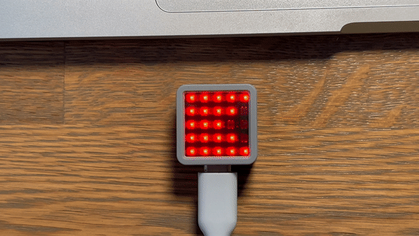

# M5 Atom Matrix

Messing around 🤡 with [TinyGo](https://tinygo.org) and [M5 Atom Matrix](https://shop.m5stack.com/products/atom-matrix-esp32-development-kit).

Several layers of abstraction for representing [Nautical flags](flags.png) with corresponding explanations. And we have quite good animation:



## Upload

```
tinygo flash \
    -port /dev/cu.usbserial-XXXXXXXXXX \
    -target=m5stack \
    cmd/main/main.go
```
where `cu.usbserial-XXXXXXXXXX` is your device's name.

## Debug

For debugging on MacOS it's convenient to use `screen`:
```
screen /dev/cu.usbserial-XXXXXXXXXX 115200
```
☝🏼 For reference, to **exit** press `Control + \`, then `y` to confirm.

## TODO

- Play with alpha-channel for resulting pixel value (maybe, add alpha for objects).
- Add fade-out and fade-in for motion.
- Add tests 😏 .
